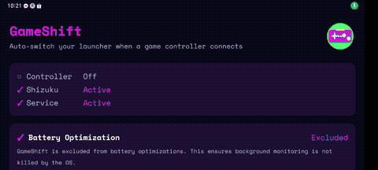
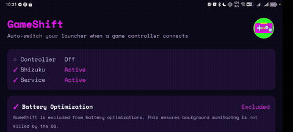
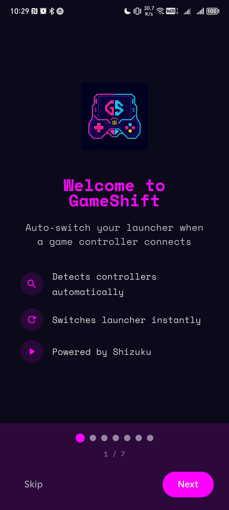
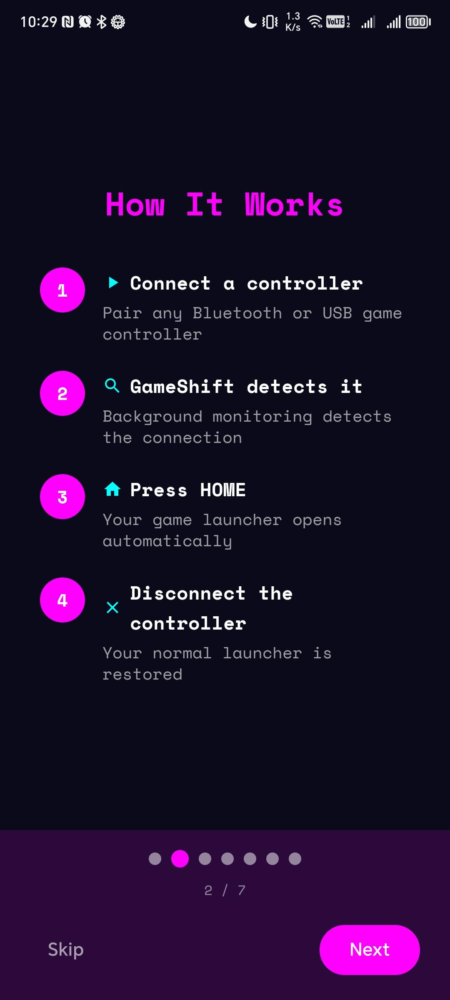
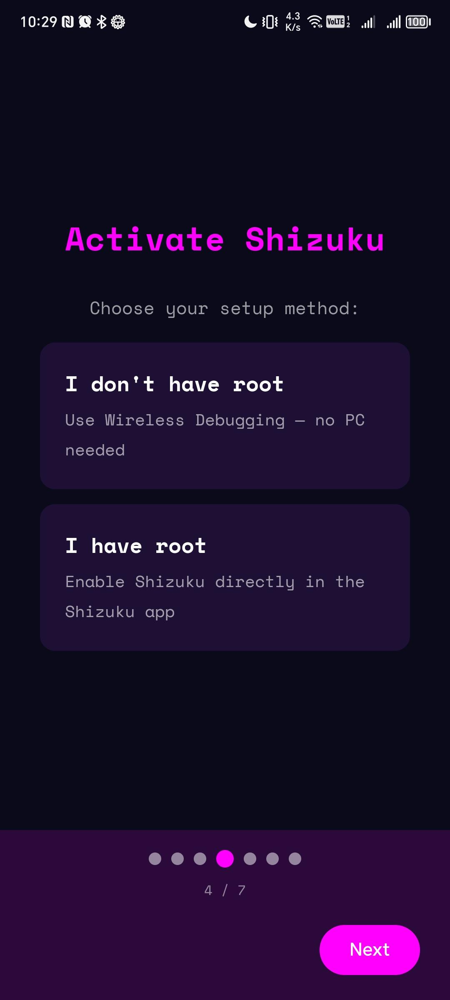
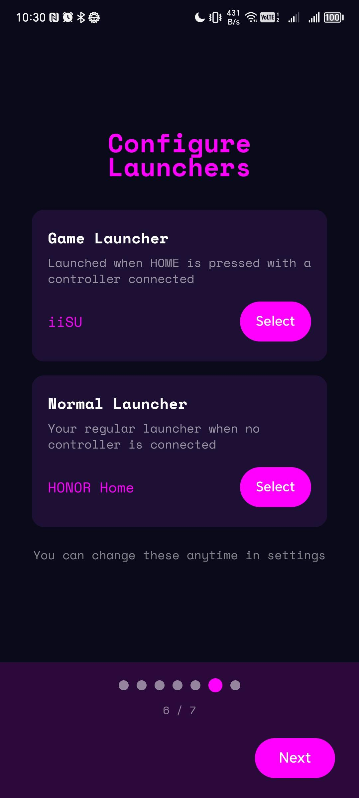
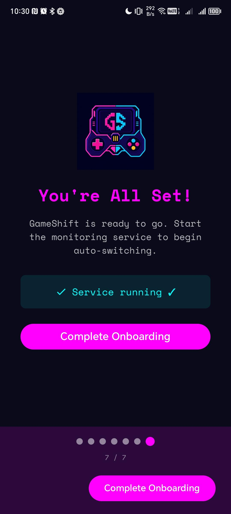
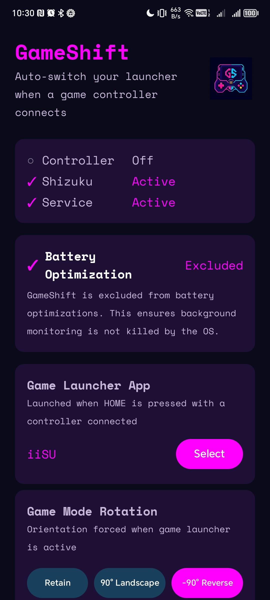

<div align="center">

# GameShift

[](https://github.com/tientien17/GameShift/releases)
[](https://opensource.org/licenses/Apache-2.0)
[](#requirements)

*Auto-switch your Android home launcher when a game controller connects.*

</div>

Plug in a gamepad → GameShift sets itself as the default HOME launcher. Press HOME and your game launcher opens instead of the system launcher. Disconnect the controller and everything goes back to normal. No root required.

Built for Android head units, retro-gaming handhelds, and any device where you want a dedicated game launcher to pop up when a controller is plugged in.

---

## Demo

| Before — No Controller | After — Controller Connected |
|:---:|:---:|
| <br/>Pressing HOME opens the normal launcher. | <br/>Pressing HOME opens your game launcher. |

## Screenshots

| Onboarding | Setup | Main Settings |
|:---:|:---:|:---:|
|  |  |  |
|  |  |  |

---

## Quick Start

### 1. Install Shizuku

GameShift uses [Shizuku](https://shizuku.rikka.app/) to switch the default launcher — it's like root access but safer and easier. Download Shizuku from [Google Play](https://play.google.com/store/apps/details?id=moe.shizuku.privileged.api) or [GitHub](https://github.com/RikkaApps/Shizuku/releases), open it, and tap **Start**. On Android 11+ you can start it wirelessly right on your phone — no computer needed.

> **Note:** Shizuku stops after every device reboot. You'll need to re-start it from the Shizuku app (or use Wireless Debugging scripts to auto-start it on rooted devices).

### 2. Install GameShift

Download the latest APK from the [Releases page](https://github.com/tientien17/GameShift/releases), open it on your device, and follow the install prompt. You may need to enable **Install from unknown apps** for your file manager or browser.

### 3. Set up

1. Open GameShift — it'll walk you through the setup.
2. Grant the Shizuku permission when prompted.
3. Pick your **Game Launcher** (the app that opens when you press HOME with a controller connected).
4. Pick your **Normal Launcher** (your usual home screen).
5. Tap **Start Service**.

### 4. Play

Connect a game controller (USB or Bluetooth). GameShift detects it, switches the HOME launcher, and shows a "Game On!" toast. Press HOME — your game launcher launches. Disconnect the controller and your normal launcher comes right back.

---

## Features

- **Automatic launcher switching** — connect a controller → GameShift takes over HOME. Disconnect → normal launcher restored.
- **HOME button routing** — press HOME with a controller connected and your game launcher opens, not the system launcher.
- **Game Mode Rotation** — force landscape, reverse landscape, or keep your current orientation when a controller is connected.
- **Boot-safe** — service restarts automatically after a reboot.
- **Battery optimization alert** — the app warns you if battery optimization might kill the service and offers a one-tap fix.
- **No root required** — Shizuku handles the elevated permissions.

## Requirements

- **Android 8.0 (API 26)** or higher
- **Shizuku** installed and running ([download](https://shizuku.rikka.app/download/))
- A game controller (USB or Bluetooth)

## Troubleshooting

### Shizuku says "not running"
Open the Shizuku app and start it. On Android 11+ you can start it wirelessly from the Shizuku app without a computer.

### Controller not detected
- Pair or connect the controller before starting the GameShift service.
- Some Bluetooth controllers use non-standard HID profiles — try USB if Bluetooth doesn't work.
- Check the GameShift notification icon — it shows whether a controller is connected.

### HOME button still opens the normal launcher
- Open GameShift and check the status cards: all three (Controller, Shizuku, Service) should show checkmarks.
- If Shizuku is off, start it from the Shizuku app.
- If the service is off, tap **Start Service** in GameShift.

### "Launcher picker" appears instead of my game
The app you selected might not have a proper home-screen intent. Try a different game launcher.

### Service stops after a while
Battery optimization may be killing it. Open the app — the battery status card will show if you're optimized. Tap **Exclude App** to fix it, or go to Settings → Apps → GameShift → Battery and set it to **Unrestricted**.

---

## Building from Source

```bash
git clone https://github.com/tientien17/GameShift.git
cd GameShift
./gradlew assembleRelease          # signed release APK
```

Output: `GameShift-v{version}-release.apk` in `app/build/outputs/apk/release/`.

---

## Contributing

Bug reports, feature requests, and pull requests are welcome. Please use the issue templates for bug reports and feature requests to help triage efficiently. See the `.github/` directory for templates.

---

## License

```
Copyright 2026 GameShift

Licensed under the Apache License, Version 2.0 (the "License");
you may not use this file except in compliance with the License.
You may obtain a copy of the License at

    http://www.apache.org/licenses/LICENSE-2.0

Unless required by applicable law or agreed to in writing, software
distributed under the License is distributed on an "AS IS" BASIS,
WITHOUT WARRANTIES OR CONDITIONS OF ANY KIND, either express or implied.
See the License for the specific language governing permissions and
limitations under the License.
```

## Acknowledgements

- **[Shizuku](https://github.com/RikkaApps/Shizuku)** — The backbone of this project.
- **[flipx](https://github.com/Flix01/flipx)** — Original inspiration for the auto-launcher-switching concept.
- **Logo & mascot** — Designer contributions welcome! Open a PR with your artwork.
